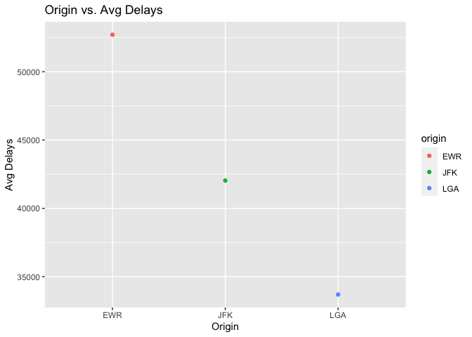
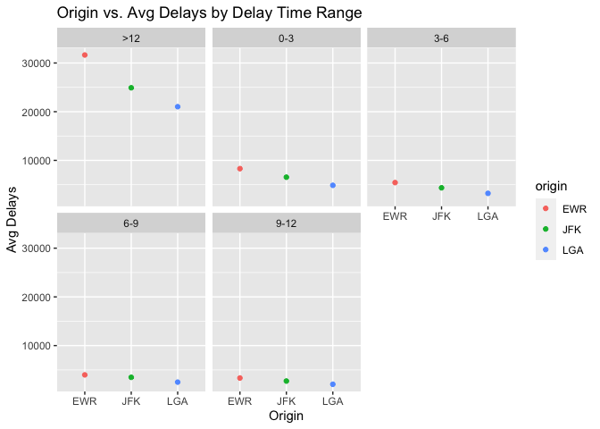
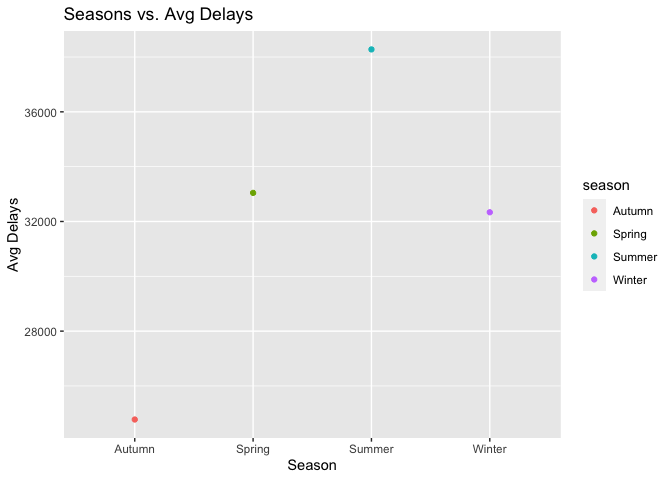
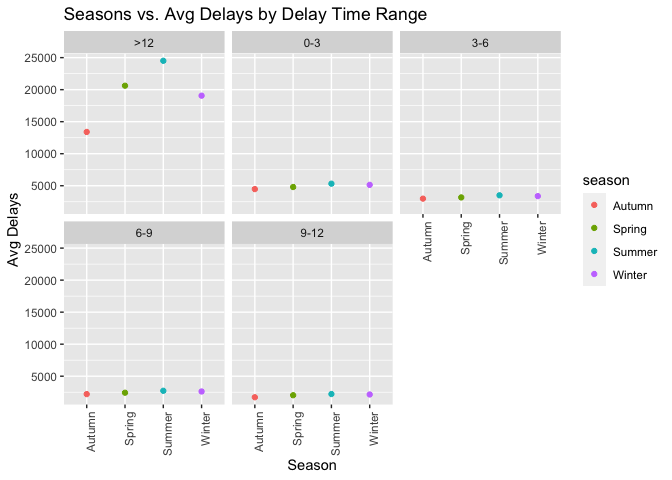
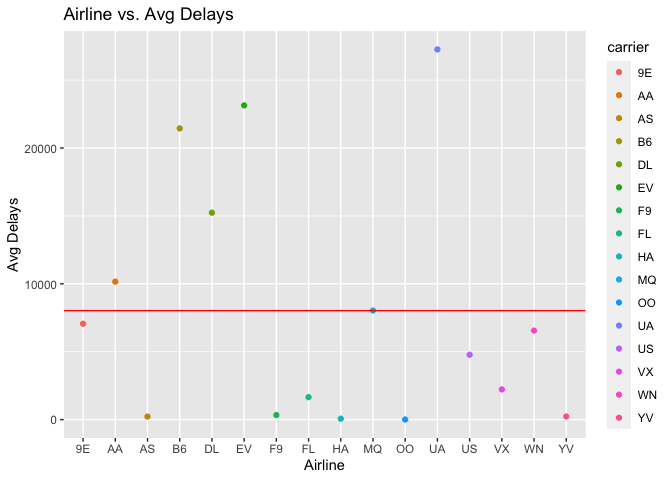

HW2
================
Lily Franks

[GitHub link](https://github.com/lilyfranks/Homework-Stat433)

What time of day should you fly if you want to avoid delays as much as
possible? Does this choice depend on anything? Season? Weather? Airport?
Airline? Find three patterns (“null results” are ok\!).

``` r
library(dplyr)
library(nycflights13)
library(ggplot2)
library(tidyr)
```

``` r
flights1 = flights %>%
  mutate(delay = case_when(dep_delay > 0 ~ 1, TRUE ~ 0), 
         delay_avg = case_when(dep_delay < 0 ~ "no delay", (dep_delay > 0 & dep_delay <= 3) ~ "0-3", (dep_delay > 3 & dep_delay <= 6) ~ "3-6", (dep_delay > 6 & dep_delay <= 9) ~ "6-9", (dep_delay > 9 & dep_delay <= 12) ~ "9-12", dep_delay > 12 ~ ">12"), 
         season = case_when(month %in% c(3, 4, 5) ~ "Spring", month %in% c(6, 7, 8) ~ "Summer", month %in% c(9, 10, 11) ~ "Autumn", month %in% c(12, 1, 2) ~ "Winter")) 

flights1
```

    ## # A tibble: 336,776 x 22
    ##     year month   day dep_time sched_dep_time dep_delay arr_time sched_arr_time
    ##    <int> <int> <int>    <int>          <int>     <dbl>    <int>          <int>
    ##  1  2013     1     1      517            515         2      830            819
    ##  2  2013     1     1      533            529         4      850            830
    ##  3  2013     1     1      542            540         2      923            850
    ##  4  2013     1     1      544            545        -1     1004           1022
    ##  5  2013     1     1      554            600        -6      812            837
    ##  6  2013     1     1      554            558        -4      740            728
    ##  7  2013     1     1      555            600        -5      913            854
    ##  8  2013     1     1      557            600        -3      709            723
    ##  9  2013     1     1      557            600        -3      838            846
    ## 10  2013     1     1      558            600        -2      753            745
    ## # … with 336,766 more rows, and 14 more variables: arr_delay <dbl>,
    ## #   carrier <chr>, flight <int>, tailnum <chr>, origin <chr>, dest <chr>,
    ## #   air_time <dbl>, distance <dbl>, hour <dbl>, minute <dbl>, time_hour <dttm>,
    ## #   delay <dbl>, delay_avg <chr>, season <chr>

**INTRODUCTION:** Flight delays have a plethora of plausible causes.
Because there is a vast majority, I decided to take a look at the
impacts of the origin, season, and airline. To begin, I created a
mutated version of the original flights dataframe. I added `delay`, a
column that dictates a delay with the value 1 or 0, `delay_avg`, a
column that groups flight delays by three hour intervals and “no delay,”
and `season`, a column that designates the month value into a named
season. I chose the determined `delay_avg` grouping because I have found
these to be the typical delay times I have experienced in my life
traveling on planes.

To begin looking at how origin affects flight delays I created two
dataframes. The first dataframe, `origins1`, is summarized by the total
delays per origin. The second dataframe, `origins2`, does the same but
is also grouped by `delay_avg`. I then decided to delete delay values of
0 as these indicated no delays, which is not useful to my analysis. My
first graph observes a negative linear regression in the order EWR, JFK,
and LGA. This makes sense as EWR is the busiest airport with the most
number of flights followed by JFK and LGA-a tibble shown below the two
graphs. I then wanted to see how `delay_avg` plays into this, so I
faceted by that column. I can see that there is no major difference
between the groups ranging from 0-12 hours of delays. However, there
were more delays shown for flights delayed more than 12 hours. While
this is an interesting find, I observe that `delay_avg` does not have a
big play in this analysis.

Next, looking at how season affects flight delays I created the same
dataframes as before but now using season instead of origin called
`seasons1` and `seasons2`. The first graph shows that overall, summer
has the most flight delays followed by spring, winter, and autumn. I am
surprised by this outcome as winter would have been my guess to have the
highest number of delays. Yet, when considering rain as a primary factor
in delays I then thought spring, being the rainiest season for many
states, would have been the highest. However, when considering weather
per season across the country, states have many differing weather
patterns per season. The second takes a look at these values faceted by
`delay_avg`. Interestingly, the original graph’s findings are mirrored
in flights delayed more than 12 hours. Whereas flights delayed between
0-12 hours show minimal change between seasons. While most of the flight
delays fall within the 0-12 hour range, there are several values beyond
that range. So, I believe the minimal change found between 0-12 hours is
due to the lower values I set as the main ranges. I believe this is also
the reason for the second origins graph as the same thing happened
there.

Lastly, looking at how airlines affect flight delays I created the same
first dataframe used in the last two analyses. To refresh your memory
this dataframe is summarized by the total delays per airline. Because
there are so many airlines the plot did not give any clear observation
as to how an airline type could speak to the number of delays. To remedy
this confusion, I added a horizontal line to the plot with the
y-intercept being the pulled overall average number of delays, being
8027 flights. In the graph I can see that American Airlines (AA),
JetBlue (B6), Delta Airlines (DL), Express Jet Airlines (EV), Envoy
Airline (MQ), and United Airlines (UA) are responsible for number of
delays at or above the overall average number of delays.

All code can be seen on GitHub within the md file.

**FINDING 1:** Origin

``` r
origins1 = flights1 %>%
  group_by(origin) %>%
  summarise(delays = sum(delay))

origins1
```

    ## # A tibble: 3 x 2
    ##   origin delays
    ##   <chr>   <dbl>
    ## 1 EWR     52711
    ## 2 JFK     42031
    ## 3 LGA     33690

``` r
origins2 = flights1 %>%
  group_by(origin, delay_avg) %>%
  summarise(delays = sum(delay)) 

origins2 <- subset(origins2, delays!=0)
origins2
```

    ## # A tibble: 15 x 3
    ## # Groups:   origin [3]
    ##    origin delay_avg delays
    ##    <chr>  <chr>      <dbl>
    ##  1 EWR    >12        31643
    ##  2 EWR    0-3         8304
    ##  3 EWR    3-6         5442
    ##  4 EWR    6-9         3984
    ##  5 EWR    9-12        3338
    ##  6 JFK    >12        24913
    ##  7 JFK    0-3         6549
    ##  8 JFK    3-6         4369
    ##  9 JFK    6-9         3484
    ## 10 JFK    9-12        2716
    ## 11 LGA    >12        21028
    ## 12 LGA    0-3         4880
    ## 13 LGA    3-6         3232
    ## 14 LGA    6-9         2495
    ## 15 LGA    9-12        2055

``` r
ggplot(origins1, aes(x = origin, y = delays, color = origin)) +
  geom_point() +
  ggtitle("Origin vs. Avg Delays") +
  xlab("Origin") +
  ylab("Avg Delays")
```

<!-- -->

``` r
ggplot(origins2, aes(x = origin, y = delays, color = origin)) +
  geom_point() +
  facet_wrap(~delay_avg) +
  ggtitle("Origin vs. Avg Delays by Delay Time Range") +
  xlab("Origin") +
  ylab("Avg Delays")
```

<!-- -->

``` r
sumflight_origins <- data.frame(EWR = sum(flights1$origin == "EWR"), JFK = sum(flights1$origin == "JFK"), LGA = sum(flights1$origin == "LGA"))

sumflight_origins
```

    ##      EWR    JFK    LGA
    ## 1 120835 111279 104662

**FINDING 2:** Season

``` r
seasons1 = flights1 %>%
  group_by(season) %>%
  summarise(delays = sum(delay))

seasons1
```

    ## # A tibble: 4 x 2
    ##   season delays
    ##   <chr>   <dbl>
    ## 1 Autumn  24776
    ## 2 Spring  33043
    ## 3 Summer  38277
    ## 4 Winter  32336

``` r
seasons2 = flights1 %>%
  group_by(season, delay_avg) %>%
  summarise(delays = sum(delay)) 

seasons2 <- subset(seasons2, delays!=0)
seasons2
```

    ## # A tibble: 20 x 3
    ## # Groups:   season [4]
    ##    season delay_avg delays
    ##    <chr>  <chr>      <dbl>
    ##  1 Autumn >12        13397
    ##  2 Autumn 0-3         4477
    ##  3 Autumn 3-6         2983
    ##  4 Autumn 6-9         2205
    ##  5 Autumn 9-12        1714
    ##  6 Spring >12        20616
    ##  7 Spring 0-3         4800
    ##  8 Spring 3-6         3175
    ##  9 Spring 6-9         2420
    ## 10 Spring 9-12        2032
    ## 11 Summer >12        24510
    ## 12 Summer 0-3         5320
    ## 13 Summer 3-6         3506
    ## 14 Summer 6-9         2724
    ## 15 Summer 9-12        2217
    ## 16 Winter >12        19061
    ## 17 Winter 0-3         5136
    ## 18 Winter 3-6         3379
    ## 19 Winter 6-9         2614
    ## 20 Winter 9-12        2146

``` r
ggplot(seasons1, aes(x = season, y = delays, color = season)) +
  geom_point() +
  ggtitle("Seasons vs. Avg Delays") +
  xlab("Season") +
  ylab("Avg Delays")
```

<!-- -->

``` r
ggplot(seasons2, aes(x = season, y = delays, color = season)) +
  geom_point() +
  facet_wrap(~delay_avg) +
  theme(axis.text.x = element_text(angle = 90, hjust = 1)) +
  ggtitle("Seasons vs. Avg Delays by Delay Time Range") +
  xlab("Season") +
  ylab("Avg Delays")
```

<!-- -->

**FINDING 3:** Airline

``` r
airline1 = flights1 %>%
  group_by(carrier) %>%
  summarise(delays = sum(delay)) 

airline1
```

    ## # A tibble: 16 x 2
    ##    carrier delays
    ##    <chr>    <dbl>
    ##  1 9E        7063
    ##  2 AA       10162
    ##  3 AS         226
    ##  4 B6       21445
    ##  5 DL       15241
    ##  6 EV       23139
    ##  7 F9         341
    ##  8 FL        1654
    ##  9 HA          69
    ## 10 MQ        8031
    ## 11 OO           9
    ## 12 UA       27261
    ## 13 US        4775
    ## 14 VX        2225
    ## 15 WN        6558
    ## 16 YV         233

``` r
ov_avg_delay = mean(airline1$delays)
ov_avg_delay
```

    ## [1] 8027

``` r
ggplot(airline1, aes(x = carrier, y = delays, color = carrier)) +
  geom_point() +
  geom_hline(yintercept=ov_avg_delay, col="red") +
  ggtitle("Airline vs. Avg Delays") +
  xlab("Airline") +
  ylab("Avg Delays") 
```

<!-- -->
